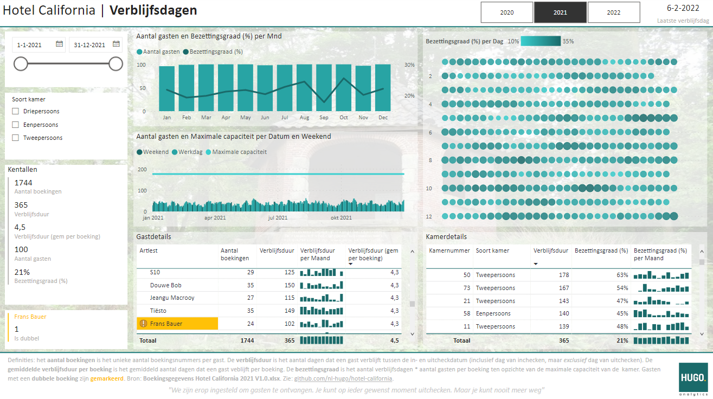
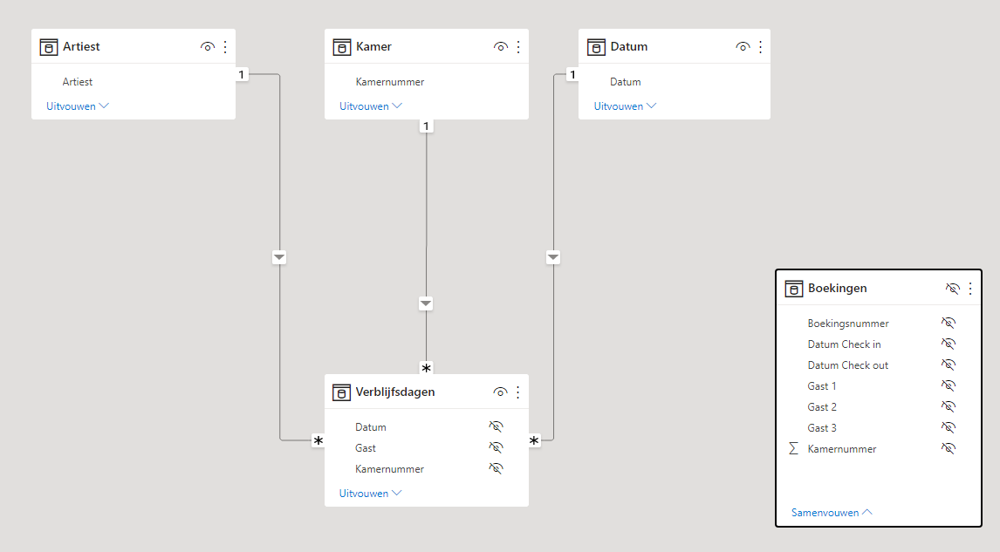

# Hotel California

Submission for the "Hotel California" Power BI challenge by Erik Horsthuis.

## Data
Data is provided in the [Excel file](Challenge/Boekingsgegevens Hotel California 2021 V1.0.xlsx) by the creator of the challenge and is the only source for this workbook.

## Model
Each of the tables are processed as-is. To overcome the check-in / check-out date problem, a [DAX script](DAX/verblijfsdagen.dax) is used to generate the `Verblijfsdagen` table.

## Code structure
- `Challenge` folder with instuctions and data file provided for this challenge.
- `DAX` folder with scripts to generate the verblijfsdagen table and measures.
- `Hotel California.pbix` is the Power BI workbook submitted for the challenge/
- `thema.json` contains the style definitions.
- various `png` files for styling purposes in the dashboard and inclusion in this readme.
